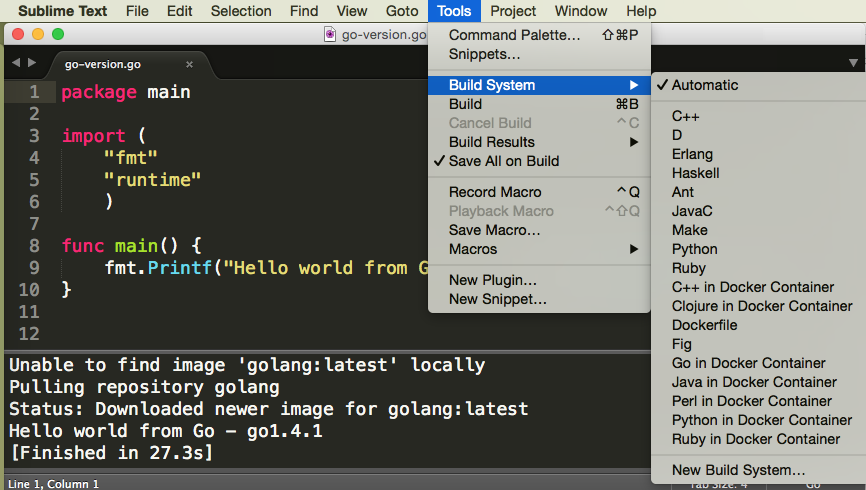
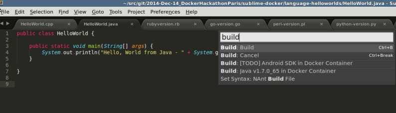
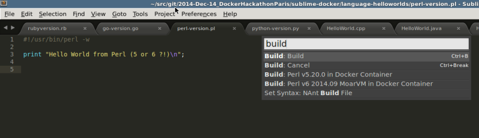

SublimeDocker
=============

A Sublime Text package that include some build systems that use [http://blog.docker.com/2014/09/docker-hub-official-repos-announcing-language-stacks/](Docker Language Stacks). It currently run python scripts and will soon support c/c++ (gcc), clojure, go (golang), hy (hylang), java, node, perl, php, python, rails, and ruby.

# Prerequisite

Requires Docker. You can get it here https://get.docker.com/

# Installation

Install using [http://wbond.net/sublime_packages/package_control](SublimeText PackageControl). Otherwise you can also Download/Clone the package and put it in your Packages-directory.

# Usage

After installing, you will find a new options in `Tools > Build system` of your Sublime menu: **Python in Docker Container**.

Remember, always you can launch the selected build with `Control+B` (Linux/Windows) or `Command+B` (OS X).

You can select specific interpreter/compiler variants with  `Control+Shift+P` (Linux/Windows) or `Command+Shift+P` (OS X)
and typing build to reduce the selection to the available build variants for the selected build system as shown below for various language build systems.

